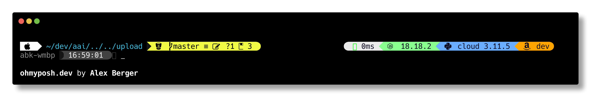

# README: tool-env repo
ABK tool environment setup for developers

[TOC]


## What is this repository for?

* Quick automated install of required developer tools
* Quick automated install of required developer apps
* Quick automated install of developer fonts
* Easy updates
* Easy user friendly prompt config
* Useful aliases
* using YubiKey for setting up security (SSH/GPG)
* Company wide password manager (WIP)


## Support for
### OS supported
- [x] MacOS
- [x] Linux / Debian distro
- [x] Linux / Ubuntu distro
- [x] Linux / Raspbian distro
- [ ] Windows

### Shells supported
- [x] /bin/bash
- [ ] /bin/csh
- [ ] /bin/ksh453945
- [ ] /bin/sh
- [ ] /bin/tcsh
- [x] /bin/zsh

### What shell are you currently using?
To determine what shell is currently used in your environment, run following command in your terminal:
```shell
echo $SHELL
```
<b>MacOS users:</b> macOS switched the default shell from <code>bash</code> to <code>zsh</code> with the release of macOS Catalina (version 10.15). If you are still using <code>bash</code>, recommendation is to switch to <code>zsh</code>, since <code>bash</code> is not being updated on MacOS. To change shell:
```shell
chsh -s /bin/zsh
```
<b>Linux users:</b> <code>zsh</code> or <code>bash</code> ... what ever floats your boat :)

****
## Pre-requisites
### MacOS
- [x] <b>pre-installed [homebrew](https://brew.sh/) tool:</b> brew is a command line tool to install apps and tools on MacOS. To install brew, run and follow prompt requests:
```shell
/bin/bash -c "$(curl -fsSL https://raw.githubusercontent.com/Homebrew/install/HEAD/install.sh)"
```

### Linux
There are no pre-requisites for Linux. We will use <code>apt</code> tool to install packages. There is home brew for Linux, called [Linuxbrew](https://docs.brew.sh/Homebrew-on-Linux), but the installation packages are not widely available yet.


## Tools installed
If you want to specify which tools are installed, please take a look at the file <code>tools.json</code>

| tool                                                                            | description                                                                  |
| :------------------------------------------------------------------------------ | :--------------------------------------------------------------------------- |
| [awscli](https://github.com/aws/aws-cli)                                        | provides a unified command line interface to Amazon Web Services             |
| [direnv](https://github.com/direnv/direnv)                                      | can load and unload env variables depending on the current project directory |
| [git](https://github.com/git/git)                                               | Newest version of git                                                        |
| [gnuPG](https://github.com/gpg/gnupg)                                           | Gnu Privacy Guard: tool to create and maintain GPG keys                      |
| [jq](https://github.com/jqlang/jq)                                              | is a lightweight and flexible command-line JSON processor                    |
| [nmap](https://nmap.org/)                                                       | network scanner to discover hosts and services on a computer network         |
| [nodenv](https://github.com/nodenv/nodenv)                                      | lets you easily switch between multiple versions of nodejs                   |
| [oh-my-posh](https://ohmyposh.dev/)                                             | lets you easiliy configure your terminal prompt                              |
| [parallel](https://github.com/flesler/parallel)                                 | CLI tool to execute shell commands in parallel                               |
| [pass](https://www.passwordstore.org)                                           | password manager, which works well with <code>direnv</code> tool             |
| [pyenv](https://github.com/pyenv/pyenv)                                         | lets you easily switch between multiple versions of Python                   |
| [pyenv-virtualenv](https://github.com/pyenv/pyenv-virtualenv)                   | is a pyenv plugin, which manages virtualenvs for Python                      |
| [serverless](https://www.serverless.com/framework/docs)                         | lets you deploy serverless infrastructure services to AWS                    |
| [tfenv](https://github.com/tfutils/tfenv)                                       | lets you easily switch between multiple versions of Terraform                |
| [tree](https://linuxhandbook.com/tree-command/)                                 | lists files in tree from                                                     |
| [wget](https://linuxize.com/post/wget-command-examples/)                        | utility for downloading files from the web                                   |
| [yq](https://github.com/mikefarah/yq)                                           | is a lightweight and flexible command-line YAML, JSON and XML processor      |
| [zsh-autocomplete](https://github.com/marlonrichert/zsh-autocomplete)           | Autocomplete for Zsh adds real-time type-ahead autocompletion to Zsh         |
| [zsh-syntax-highlighting](https://github.com/zsh-users/zsh-syntax-highlighting) | syntax highlighting for the shell zsh Zsh                                    |


## Additional MacOS apps installed

| tool                                                               | description                                                             |
| :----------------------------------------------------------------- | :---------------------------------------------------------------------- |
| [balenaetcher](https://github.com/balena-io/etcher)                | Etcher is a powerful OS image flasher built with web technologies       |
| [brave-browser](https://github.com/brave/brave-browser)            | Secure, fast Web browser based on Chromium just like Chrome             |
| [docker](https://github.com/docker)                                | Docker helps developers to abstract virtual environments                |
| [flycut](https://github.com/TermiT/Flycut)                         | Flycut is a clean and simple clipboard manager for developers           |
| [microsoft-teams](https://www.microsoft.com/en-us/microsoft-teams) | Company's online meeting app                                            |
| [mqttx](https://mqttx.app/)                                        | MQTTX makes developing and testing MQTT applications faster and easier. |
| [onedrive](https://www.microsoft.com/en-us/microsoft-365/onedrive) | Company's online storage.                                               |
| [raspberry-pi-imager](https://github.com/raspberrypi/rpi-imager)   | Raspberry Pi Imaging Utility                                            |
| [slack](https://slack.com/)                                        | Company's quick message communication app                               |
| [visual-studio-code](https://github.com/microsoft/vscode)          | The best code editor ever :)                                            |
| [vlc](https://github.com/videolan/vlc)                             | VLC is a libre and open source media player and multimedia engine       |


## Fonts installed
Those font are useful for coding and for oh-my-posh

* font-agave-nerd-font
* font-comic-shanns-mono-nerd-font
* font-droid-sans-mono-nerd-font"
* font-cascadia-code
* font-cascadia-code-pl
* font-caskaydia-cove-nerd-font
* font-hack-nerd-font


## oh-my-posh configuration
There is a pre-configured theme located in folder <code>./unixBin/env/omp/themes</code>. If you like to configure your own theme follow: [oh-my-posh documentation](https://ohmyposh.dev/docs). There are also many other predefined themes. You can activate them in the file: <code>./unixBin/env/XXX_oh-my-posh.env</code> Default is configured fro ABK customized prompt: code>./unixBin/env/omp/themes/powerlevel10k_abk.omp.json</code>, which looks like this:


* Note 1: if you don't see correct symbols in the prompt, please use font which is capable to display glyphs (symbols) in your terminal app settings. A good font example: Hack Nerd Font
* Note 2: The default oh-my-posh theme is based on dark background terminal app profile. If you like to use my profile please import it from <code>./unixBin/env/terminal/profiles/Solarized Dark.terminal</code>


## Aliases
Don't forget to check out many aliases configured in <code>./unixBin/env/002_aliases.env</code> and <code>./unixBin/env/002_abk_aliases.env</code>. Here are few good examples:

| alias         | description                                                   |
| :------------ | :------------------------------------------------------------ |
| epoch         | copies current epoch time into clipboard                      |
| getAwsAccount | copies currently configured AWS account number into clipboard |
| glrt          | Git List Remote Tags                                          |
| dpps          | Display Python Package Size                                   |
| ncpu          | Number of CPUs                                                |
| ppp           | Pretty Print PATH                                             |
| pppp          | Pretty Print PYTHONPATH                                       |
| prg           | git push - Push it Real Good - when deploying new release     |
| snp           | git push - Salt 'N Pepper version                             |


## What to do?
### Install
This script will install tools and apps described in the <code>tools.json</code>. If you already installed a tool previously, the installation will skip that tool installation and configuration. All installed tools are recorded in <code>./unixPackages/installed.json</code>
```shell
./install.sh
```

### Update
This script will update tools and apps described in the <code>tools.json</code>.
```shell
./update.sh
```

### Uninstall
If at some point you'd like to uninstall everything installed (the installed tools are recorded in <code>./unixPackages/installed.json</code>), simply run:
```shell
./uninstall.sh
```
