# README: abk_env repo 
ABK tool environment setup for developers

[TOC]


## What is this repository for?

* Quick automated install of required developer tools, apps and fonts
* Easy updates
* Easy user friendly prompt config
* Useful aliases
* using YubiKey for setting up security (SSH/GPG)
* Private/Company wide pass manager


## Design
Check, install and uninstall instructions are configured in json files

### life cycle of installed tools

```mermaid
flowchart LR
    %% Define styles
    classDef jsonStyle fill:#e3f2fd,stroke:#2196f3,stroke-width:2,color:#0d47a1;
    classDef installStyle fill:#e8f5e9,stroke:#4caf50,stroke-width:2,color:#1b5e20;
    classDef procStyle fill:#fffde7,stroke:#fbc02d,stroke-width:2,stroke-dasharray: 5, color:#f57f17;
    classDef uninstallStyle fill:#fff3e0,stroke:#ff9800,stroke-width:2,color:#e65100;
    classDef testStyle fill:#fce4ec,stroke:#e91e63,stroke-width:2,color:#880e4f;

    %% Define nodes
    json_files("📁 <b>JSON files</b><br/>tools_abk.json<br/>tools_node.json<br/>tools_python.json<br/>tools_work.json")
    install("📦 <b>install.sh</b>")
    installed("🗂️ <b>Uninstall instructions</b><br/>for installed tools<br/>in <b>unixPackages</b> dir")
    uninstall("🧹 <b>uninstall.sh</b>")

    %% Apply styles
    class json_files jsonStyle
    class install installStyle
    class installed procStyle
    class uninstall uninstallStyle

    %% Define edges
    json_files --> install
    install --> installed
    installed --> uninstall
```



## Support for
### OS supported
- [x] MacOS
  - [ ] 11 - Big Sur - could work, not tested
  - [ ] 12 - Monterey - could work, not tested
  - [x] 13 - Ventura
  - [x] 14 - Sonoma
  - [x] 15 - Sequoia
- [x] Linux / Debian distro
  - [x] 11 - bullseye
  - [x] 12 - bookworm
- [x] Linux / Ubuntu distro
  - [ ] 20.04 - support removed
  - [x] 22.04
  - [x] 24.04
- [x] Linux / Raspbian distro
  - [x] 11 - bullseye
  - [x] 12 - bookworm
- [ ] Windows

### Shells supported
- [x] /bin/bash
- [ ] /bin/csh
- [ ] /bin/ksh
- [ ] /bin/sh
- [ ] /bin/tcsh
- [x] /bin/zsh

### What shell are you currently using?
To determine what shell is currently used in your environment, run following command in your terminal:
```shell
echo $SHELL
```
<b>MacOS users:</b> macOS switched the default shell from <code>bash</code> to <code>zsh</code> with the release of macOS Catalina (version 10.15). If you are still using <code>bash</code>, recommendation is to switch to <code>zsh</code>, since <code>bash</code> is not being updated on MacOS. To change shell:
```shell
chsh -s /bin/zsh
```
<b>Linux users:</b> <code>zsh</code> or <code>bash</code> ... what ever floats your boat :)

****
## Pre-requisites
### MacOS
- [x] <b>pre-installed [homebrew](https://brew.sh/) tool:</b> brew is a command line tool to install apps and tools on MacOS. To install brew, run and follow prompt requests:
```shell
/bin/bash -c "$(curl -fsSL https://raw.githubusercontent.com/Homebrew/install/HEAD/install.sh)"
```

### Linux

There are no pre-requisites for Linux. We will use <code>apt</code> tool to install packages. There is home brew for Linux, called [Linuxbrew](https://docs.brew.sh/Homebrew-on-Linux), but the installation packages are not widely available yet.


## Install

* <i><b>If you installed my previous version of ABK environment from [abkEnv](https://github.com/alexbigkid/abkEnv), please de-install it first by executing uninstall script:</b></i> <code>./uninstall.sh</code>
* For [simple minimal](https://github.com/alexbigkid/abk_env/blob/main/tools_min.json) installation: <code>./install.sh</code>
* For [python tools](https://github.com/alexbigkid/abk_env/blob/main/tools_python.json) installation: <code>./install.sh tools_python.json</code>
* For [node tools](https://github.com/alexbigkid/abk_env/blob/main/tools_node.json) installation: <code>./install.sh tools_node.json</code>
* For [my favorite tools](https://github.com/alexbigkid/abk_env/blob/main/tools_abk.json) installation: <code>./install.sh tools_abk.json</code>
* Note that you can install with several packages. E.g.: <code>./install.sh tools_node.json tools_python.json</code>. Tools which has been already installed won't be installed again.
* See table below for full list of installation sets. You can also create your own set (json files) if like. but be aware that there are 3 sections: check, install and uninstall
* The installation might require your password few times in order to install graphical apps.
* After installation script runs through, it records what tools has been installed for later clean de-installation. See files in the dir: <code>unixPackages</code>


### Available installation packages

For you convenience I prepared few installation packages listed below:

| package                                                                                | description                                                           |
| :------------------------------------------------------------------------------------- | :-------------------------------------------------------------------- |
| [tools_abk.json](https://github.com/alexbigkid/abk_env/blob/main/tools_abk.json)       | my favorite tools collection - mostly for development                 |
| [tools_max.json](https://github.com/alexbigkid/abk_env/blob/main/tools_max.json)       | maximal installation - all tools, I found useful                      |
| [tools_min.json](https://github.com/alexbigkid/abk_env/blob/main/tools_min.json)       | minimal installation - but installs brave-browser and flycut on MacOS |
| [tools_node.json](https://github.com/alexbigkid/abk_env/blob/main/tools_node.json)     | node tools installation - for node development                        |
| [tools_python.json](https://github.com/alexbigkid/abk_env/blob/main/tools_python.json) | python tools installation - for python development                    |
| [tools_work.json](https://github.com/alexbigkid/abk_env/blob/main/tools_work.json)     | work specific tools installation                                      |
| [test_001.json](https://github.com/alexbigkid/abk_env/blob/main/test_001.json)         | test 001 installation - small set of tools for testing purpose        |
| [test_002.json](https://github.com/alexbigkid/abk_env/blob/main/test_002.json)         | test 002 installation - small set of tools for testing purpose        |
| [test_003.json](https://github.com/alexbigkid/abk_env/blob/main/test_003.json)         | test 003 installation - small set of tools for testing purpose        |
| [test_004.json](https://github.com/alexbigkid/abk_env/blob/main/test_004.json)         | test 004 installation - small set of tools for testing purpose        |


### Example of tools installed

| tool                                                                            | description                                                                                                   |
| :------------------------------------------------------------------------------ | :------------------------------------------------------------------------------------------------------------ |
| [awscli](https://github.com/alexbigkid/abk_env/blob/main/tools_min.json)        | provides a unified command line interface to Amazon Web Services                                              |
| [direnv](https://github.com/direnv/direnv)                                      | can load and unload env variables depending on the current project directory                                  |
| [git](https://github.com/git/git)                                               | Newest version of git                                                                                         |
| [gnuPG](https://github.com/gpg/gnupg)                                           | Gnu Privacy Guard: tool to create and maintain GPG keys                                                       |
| [jq](https://github.com/jqlang/jq)                                              | is a lightweight and flexible command-line JSON processor                                                     |
| [nmap](https://nmap.org/)                                                       | network scanner to discover hosts and services on a computer network                                          |
| [nodenv](https://github.com/nodenv/nodenv)                                      | lets you easily switch between multiple versions of nodejs                                                    |
| [oh-my-posh](https://ohmyposh.dev/)                                             | lets you easiliy configure your terminal prompt                                                               |
| [parallel](https://github.com/flesler/parallel)                                 | CLI tool to execute shell commands in parallel                                                                |
| [pass](https://www.passwordstore.org)                                           | password manager, which works well with <code>direnv</code> tool                                              |
| [pyenv](https://github.com/pyenv/pyenv)                                         | lets you easily switch between multiple versions of Python                                                    |
| [pyenv-virtualenv](https://github.com/pyenv/pyenv-virtualenv)                   | is a pyenv plugin, which manages virtualenvs for Python                                                       |
| [ruff](https://github.com/astral-sh/ruff)                                       | python code linter                                                                                            |
| [serverless](https://www.serverless.com/framework/docs)                         | lets you deploy serverless infrastructure services to AWS                                                     |
| [tfenv](https://github.com/tfutils/tfenv)                                       | lets you easily switch between multiple versions of Terraform                                                 |
| [tree](https://linuxhandbook.com/tree-command/)                                 | lists files in tree from                                                                                      |
| [uv](https://github.com/astral-sh/uv)                                           | Fast Python package manager. Can replace: <code>pip, pip-tools, pipx, poetry, pyenv, twine, virtualenv</code> |
| [wget](https://linuxize.com/post/wget-command-examples/)                        | utility for downloading files from the web                                                                    |
| [yq](https://github.com/mikefarah/yq)                                           | is a lightweight and flexible command-line YAML, JSON and XML processor                                       |
| [zsh-autocomplete](https://github.com/marlonrichert/zsh-autocomplete)           | Autocomplete for Zsh adds real-time type-ahead autocompletion to Zsh                                          |
| [zsh-autosuggestions](https://github.com/zsh-users/zsh-autosuggestions)         | Autosuggestions for Zsh adds autosuggestions below prompt, which can be selected                              |
| [zsh-syntax-highlighting](https://github.com/zsh-users/zsh-syntax-highlighting) | syntax highlighting for the shell zsh Zsh                                                                     |


### Example of MacOS apps installed

| tool                                                               | description                                                   |
| :----------------------------------------------------------------- | :------------------------------------------------------------ |
| [brave-browser](https://github.com/brave/brave-browser)            | Secure, fast Web browser based on Chromium just like Chrome   |
| [docker](https://github.com/docker)                                | Docker helps developers to abstract virtual environments      |
| [flycut](https://github.com/TermiT/Flycut)                         | Flycut is a clean and simple clipboard manager for developers |
| [onedrive](https://www.microsoft.com/en-us/microsoft-365/onedrive) | Company's online storage.                                     |
| [visual-studio-code](https://github.com/microsoft/vscode)          | The best code editor ever :)                                  |


### Fonts installed
Those font are useful for coding and for oh-my-posh

* font-agave-nerd-font
* font-comic-shanns-mono-nerd-font
* font-droid-sans-mono-nerd-font"
* font-cascadia-code
* font-cascadia-code-pl
* font-caskaydia-cove-nerd-font
* font-hack-nerd-font


## oh-my-posh configuration
* open terminal app
* click on Terminal / Settings (on MacOS: Press <code>&#x2318; + ,</code>)
* click in the bottom left corner on a circle with 3 dots and import
* Navigate to repo directory and then to: <code>unixBin/env/terminal/profiles</code>
* Select <code>Solarized Dark.terminal</code>
* Select the Profile just added and the click on <code>Default</code> in the bottom left corner

There is a pre-configured theme located in folder <code>./unixBin/env/omp/themes</code>. There are many other predefined themes. You can activate them in the file: <code>./unixBin/env/XXX_oh-my-posh.env</code> Default is configured for ABK customized prompt: <code>./unixBin/env/omp/themes/powerlevel10k_abk.omp.json</code>, which looks like this:


If you like to create your own theme please follow: [oh-my-posh documentation](https://ohmyposh.dev/docs).

* Note 1: if you don't see correct symbols in the prompt, please use font which is capable to display glyphs (symbols) in your terminal app settings. A good font example: Hack Nerd Font
* Note 2: The default oh-my-posh theme is based on dark background terminal app profile. It might not look great if you use theme with bright background.


## Aliases
Don't forget to check out many aliases configured in <code>./unixBin/env/002_aliases.env</code> and <code>./unixBin/env/002_abk_aliases.env</code>. YOu can put your own aliases into <code>./unixBin/env/aliases_user.env</code> Here are few good examples:

| alias                          | description                                                   |
| :----------------------------- | :------------------------------------------------------------ |
| <code>epoch</code>             | copies current epoch time into clipboard                      |
| <code>getAwsAccount</code>     | copies currently configured AWS account number into clipboard |
| <code>glrt</code>              | Git List Remote Tags                                          |
| <code>dpps</code>              | Display Python Package Size                                   |
| <code>ncpu</code>              | Number of CPUs                                                |
| <code>ppp</code>               | Pretty Print PATH                                             |
| <code>pppp</code>              | Pretty Print PYTHONPATH                                       |
| <code>prg</code>               | git push - Push it Real Good - when deploying new release     |
| <code>snp</code>               | git push - Salt 'N Pepper version                             |
| <code>brew_update</code>       | MacOS users: updates all tools managed by brew                |
| <code>brew_update_casks</code> | MacOS users: updates all graphical apps managed by brew       |
| <code>brew_update_all</code>   | MacOS users: updates tools and apps managed by brew           |
| <code>apt_update</code>        | Linux users: updates all tools managed by apt                 |


## Update
To update your tools you could use the alias:
* <code>brew_update</code>> - (MacOS) to update all brew installed tools
* <code>brew_update_casks</code>> - (MacOS) to update all brew installed graphical apps
* <code>brew_update_all</code> - (MacOS) update both tools and graphical apps
* <code>apt_update</code> - (Linux) updates all tools managed by apt


## Uninstall
If at some point you'd like to uninstall installed packages, you can run <code>./uninstall.sh</code>. Here few examples:
* <code>./uninstall.sh tools_node.json</code> - will uninstall all node packages. Since it was recorded what tools have been installed only the packages which has been previously installed with <code>tools_node.json</code> will be uninstalled.
* <code>./uninstall.sh tools_min.json</code> - uninstalls packages previously has installed with <code>tools_min.json</code>
* <code>./uninstall.sh tools_min.json tools_node.json</code> - uninstalls packages previously has installed with <code>tools_min.json</code> and <code>tools_node.json</code>
